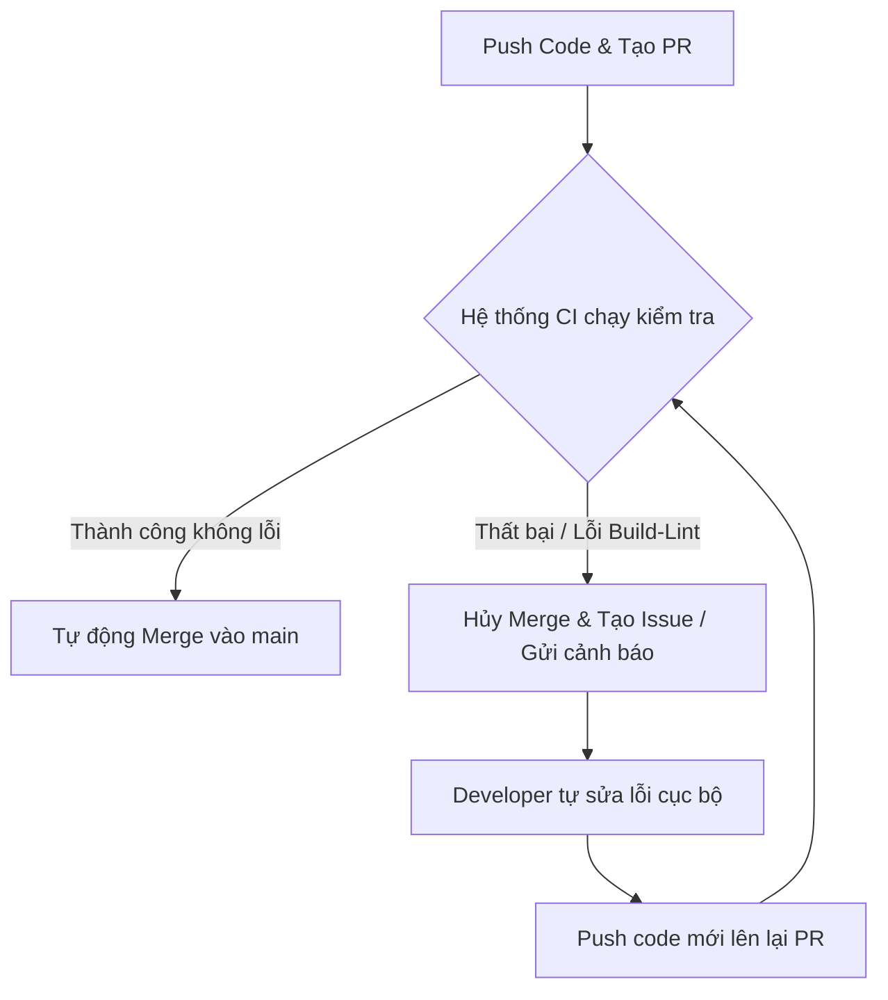

# Quy trình phát triển & Cấu hình dự án (Development Guide)

Tài liệu này hướng dẫn chi tiết cách thiết lập dự án, cài đặt môi trường và quy trình làm việc với Git branch/CI-CD cho toàn bộ dự án **Wedora**.

---

## 1. Khởi động dự án (Setup & Installation)

Dự án sử dụng mô hình monorepo quản lý bằng **pnpm** để tối ưu hóa bộ nhớ ổ đĩa thông qua cơ chế Content-addressable store (không sao chép trùng lặp các dependency giống nhau giữa frontend và backend).

### Yêu cầu hệ thống:
* Node.js phiên bản >= 18
* **pnpm** (Nếu chưa cài đặt, chạy lệnh: `npm install -g pnpm`)

### Bước 1: Pull source code từ repository
```bash
git clone <repository_url>
cd Wedora
```

### Bước 2: Setup Node Modules (Tiết kiệm bộ nhớ)
Chạy lệnh duy nhất ở thư mục gốc (root) để cài đặt toàn bộ dependencies cho tất cả workspace (`frontend`, `backend`):
```bash
pnpm install
```
> Tại sao dùng pnpm? Các gói thư viện sẽ được lưu tập trung trong store toàn cục và chỉ liên kết cứng (hard-link) vào từng thư mục dự án con. Dung lượng ổ cứng tiêu tốn sẽ giảm tới 60-70% so với npm/yarn truyền thống.

### Bước 3: Chạy ứng dụng (Runtime)
* **Frontend (Next.js)**:
  ```bash
  cd frontend
  pnpm dev
  ```
* **Mobile (Flutter)**:
  ```bash
  cd mobile
  flutter pub get
  flutter run
  ```

---

## 2. Quy trình phát triển tính năng mới (Git Workflow)

Để giữ cho nhánh chính `main`/`master` luôn hoạt động ổn định và tối ưu hóa CI/CD, hãy tuân thủ nghiêm ngặt quy trình dưới đây:

### Bước 2.1: Tạo nhánh mới (Branching)
Khi phát triển bất kỳ tính năng nào, **không** được commit trực tiếp lên `main`. Bắt buộc phải tạo branch mới theo cú pháp:
```text
feature/ten-tinh-nang
```
*Ví dụ: `feature/login-google`, `feature/dashboard-ui`*

Lệnh tạo nhanh và chuyển sang nhánh mới:
```bash
git checkout -b feature/ten-tinh-nang
```

### Bước 2.2: Tự động hóa Pipeline (CI/CD)
Khi đẩy code lên và tạo Pull Request (PR) từ nhánh `feature/...` về `main`:



* **Trường hợp thành công (Không lỗi Lint/Typecheck/Build)**: Hệ thống CI/CD được thiết lập tự động duyệt và merge (Auto-merge) nhánh feature vào nhánh chính.
* **Trường hợp thất bại**: Hệ thống sẽ tự động chặn merge, tạo **Issue** cảnh báo lỗi. Lập trình viên phải tự sửa lỗi ở máy cá nhân (Local), sau đó commit & push đè lên để kích hoạt lại pipeline kiểm tra.

---

## 3. Kiểm tra trước khi Commit (Pre-commit Hook)

Dự án cấu hình **Husky** và **lint-staged**. Mỗi khi thực hiện `git commit`, hệ thống tự động kiểm tra code bị thay đổi:
* Định dạng code và kiểm tra lỗi cú pháp (Linter).
* Tránh commit code rác hoặc code lỗi lên repository.

> Nếu pre-commit hook báo lỗi đỏ, hãy sửa triệt để các lỗi đó trước khi tiến hành commit lại.
